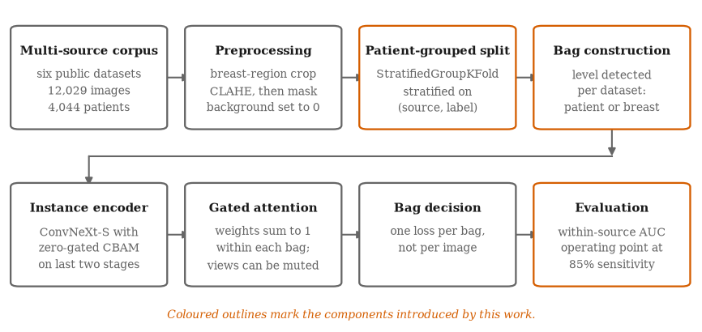
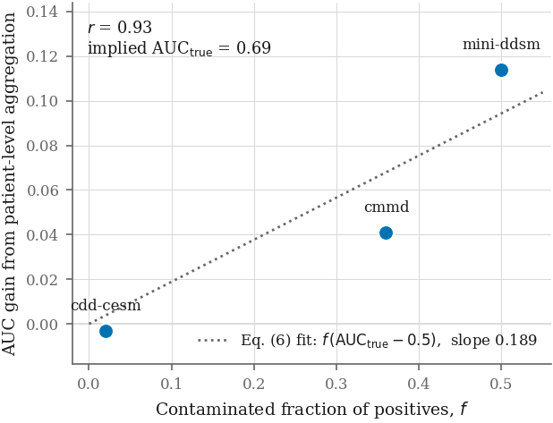
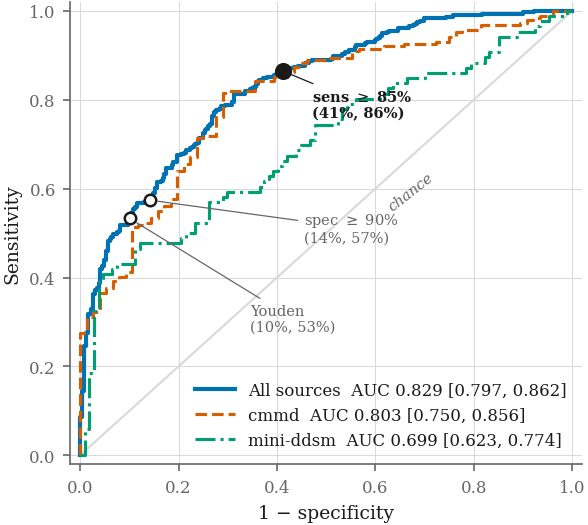

# MammoClasification

**Clasificación benigno/maligno de mamografías con Multiple Instance Learning y atención, entrenada sobre seis bases de datos públicas, con un protocolo de evaluación diseñado para no engañarse con atajos.**


> **English summary:** Benign vs. malignant mammogram classifier trained on six pooled public datasets. The project's main contribution is the evaluation protocol: it detects patient leakage and dataset-identity shortcuts, shows that most public datasets label the *patient* rather than the *image* (so ~half of "malignant" images show a healthy breast), and fixes it with attention-based Multiple Instance Learning. Result: **bag-level AUC 0.829 (95% CI 0.797–0.862)** on a leakage-free test set, at 86% sensitivity. A paper draft is included in [`article/paper.md`](article/paper.md).

---

## Resultados en 30 segundos

| Métrica (test, sin fuga de pacientes) | Valor |
|---|---|
| AUC a nivel de bolsa (paciente/mama) | **0.8294** (IC 95 % [0.797, 0.862]) |
| AUC *within-source* (sin efecto de la fuente) | **0.7671** |
| Sensibilidad / Especificidad | 86.44 % / 58.74 % |
| Mejora frente al modelo por imagen (DeLong pareado) | +0.037 AUC, *p* = 0.025 |

<p align="center">
  
</p>

---

## El problema

Las bases públicas de mamografía son pequeñas, así que lo habitual es juntar varias. Al hacerlo aparecen dos trampas que la evaluación convencional no detecta. Este proyecto las mide y las corrige:

1. **Fuga de pacientes.** La partición original separaba por imagen, no por paciente: **el 91.6 % de las filas de test pertenecían a pacientes vistos en entrenamiento**. La exactitud reportada (82 %) estaba inflada.
2. **La fuente como atajo.** Cada base tiene una prevalencia de cáncer distinta (de 0 % a 78.7 %). Un clasificador que **no mira la imagen** y solo sabe de qué base viene alcanza **70.6 % de exactitud**. Por eso reporto un **AUC *within-source***, que solo compara pares benigno/maligno de la misma base.
3. **Etiquetas por paciente, no por imagen.** En 3 de 4 bases, el 100 % de los pacientes con ambas mamas tienen la misma etiqueta en las dos. Como el cáncer de mama es unilateral en el 95–98 % de los casos, **cerca de la mitad de las imágenes "malignas" muestran una mama sana**. Entrenar por imagen castiga a la red cuando acierta.

## La solución

- **Particiones sin fuga** con `StratifiedGroupKFold`, agrupando por paciente y estratificando por (fuente, etiqueta). Fuga verificada: 0.00 %.
- **Preprocesado que elimina pistas de la fuente**: recorte de la mama (Otsu + componente conexa), CLAHE *antes* de enmascarar y fondo exactamente en 0 tras normalizar. Sin erosión, para no borrar microcalcificaciones.
- **Multiple Instance Learning con atención con compuerta** (Ilse et al., 2018): cada paciente es una "bolsa" de imágenes y la pérdida se calcula una vez por bolsa. El nivel de la bolsa (paciente o mama) **se detecta automáticamente por base de datos**.
- **Codificador ConvNeXt-Small + CBAM con compuerta residual inicializada en cero**, para no degradar los pesos preentrenados al insertar atención.
- **Umbral elegido solo en validación**, con sensibilidad objetivo ≥ 85 % (más apropiado para cribado que el índice de Youden).
- **Rigor estadístico**: IC de Hanley–McNeil, prueba de DeLong pareada y un modelo de ruido de etiquetas cuya predicción se confirma entre bases (*r* = 0.93).

<p align="center">
  
  
</p>

### Qué no funcionó (y por qué importa)

Reporto tres resultados negativos, porque descartan explicaciones alternativas:

| Intervención | Efecto en el AUC *within-source* |
|---|---|
| Subir la resolución de 512 a 1024 px | 0.6734 → 0.6616 (sin mejora) |
| Regularización fuerte (brecha train–val de 28 a 17 puntos) | sin cambio |
| Ensamble MIL + modelo por imagen | 0.8294 → 0.8204 (empeora) |

La conclusión: **el límite no lo pone la capacidad del modelo, sino la granularidad de las etiquetas.**

### Evolución del rendimiento

| Configuración | AUC global | AUC *within-source* | Nivel de decisión |
|---|---|---|---|
| ConvNeXt-B, 512 px | 0.7520 | 0.6734 | Imagen |
| ConvNeXt-S, 1024 px + regularización | 0.7332 | 0.6616 | Imagen |
| ↳ mismo modelo agregado por paciente | 0.7872 | 0.7378 | Paciente |
| **MIL con atención (propuesto)** | **0.8294** | **0.7671** | Bolsa |

---

## Estructura del repositorio

```
.
├── make_splits.py          # Particiones train/val/test agrupadas por paciente
├── check_resolution.py     # Resolución nativa vs. efectiva (¿sobreviven las microcalcificaciones?)
├── cnn_mammo.py            # Modelo por imagen: ConvNeXt + CBAM, EMA, muestreo balanceado
├── mil_mammo.py            # Modelo MIL con pooling de atención con compuerta
├── mammo-bench.csv         # Índice de imágenes del corpus multi-fuente (metadatos, sin imágenes)
├── splits/                 # Particiones generadas (train/val/test.csv)
├── runs/                   # Predicciones y curvas del modelo por imagen
├── runs_mil/               # Predicciones y curvas del modelo MIL
└── article/
    ├── paper.md            # Borrador del artículo (metodología y resultados completos)
    ├── make_figures.py     # Genera las figuras del artículo
    ├── delong_test.py      # Prueba de DeLong pareada entre modelos
    ├── export_attention.py # Exporta los pesos de atención por instancia
    └── figures/            # Figuras en PDF y PNG
```

## Datos

El índice `mammo-bench.csv` reúne siete colecciones públicas: CMMD, Mini-DDSM, CDD-CESM, INbreast, KAU-BCMD, DMID y RSNA Screening. RSNA se excluye por defecto porque solo contiene casos benignos (sería un atajo perfecto). Tras filtrar quedan **12,029 imágenes de 4,044 pacientes**.

Las imágenes **no se incluyen** en el repositorio; deben descargarse de sus proveedores y apuntarse con `--base-dir`.

## Cómo reproducirlo

```bash
pip install -r requirements.txt

# 1. Particiones sin fuga de pacientes
python make_splits.py --bench mammo-bench.csv --outdir splits

# 2. (Opcional) Comprobar la resolución útil de las imágenes
python check_resolution.py --data-dir splits --base-dir /ruta/a/imagenes

# 3. Modelo base por imagen
python cnn_mammo.py --data-dir splits --base-dir /ruta/a/imagenes --cache-dir cache

# 4. Modelo MIL (configuración del artículo)
python mil_mammo.py --data-dir splits --base-dir /ruta/a/imagenes --cache-dir cache1024 \
    --arch convnext_small --img-size 1024 --bag-batch 1 --accum 16

# 5. Análisis y figuras
python article/delong_test.py --mil runs_mil/predicciones_test_mil.csv --cnn runs/predicciones_test.csv
python article/make_figures.py --mil runs_mil/predicciones_test_mil.csv --outdir article/figures
```

Los pasos 3 y 4 requieren GPU (el entrenamiento MIL a 1024 px usa una bolsa por paso con acumulación de gradiente de 16). Los pasos 1 y 5 corren en CPU con los CSV incluidos.

## Lo que aprendí

- Que una métrica alta no basta: antes de mejorar el modelo hay que auditar **qué está aprendiendo** (fuga de pacientes, atajos de la fuente).
- A formular una **hipótesis falsable** (el modelo de ruido de etiquetas) y comprobarla con los datos antes de cambiar la arquitectura.
- A comparar modelos con la prueba estadística correcta (DeLong pareado) en lugar de mirar si los intervalos se solapan.
- A documentar los **resultados negativos**, que acotan el problema tanto como los positivos.

## Contexto

Proyecto desarrollado en el Laboratorio de Investigación en Inteligencia Artificial y Computación Médica (LIIACOM) de la Universidad Autónoma de Chihuahua. El artículo completo, con ecuaciones, tablas por fuente y referencias, está en [`article/paper.md`](article/paper.md).

**Palabras clave:** visión por computadora · imagen médica · deep learning · PyTorch · Multiple Instance Learning · mecanismos de atención · aprendizaje por atajos · ruido en etiquetas · evaluación estadística

---

📫 **Contacto:** [GitHub @Turris20](https://github.com/Turris20)
